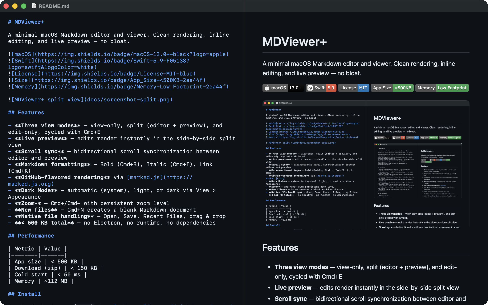

# MDViewer+

A minimal macOS Markdown editor and viewer. Clean rendering, inline editing, and live preview — no bloat.




## Features

- **Three view modes** — view-only, split (editor + preview), and edit-only, cycled with Cmd+E
- **Live preview** — edits render instantly in the side-by-side split view
- **Syntax highlighting** — headings, bold, italic, links, code blocks, blockquotes, and list markers color-coded in the editor
- **Scroll sync** — bidirectional scroll synchronization between editor and preview
- **Markdown formatting** — Bold (Cmd+B), Italic (Cmd+I), Link (Cmd+K)
- **GitHub-flavored rendering** via [marked.js](https://marked.js.org)
- **Dark Mode** — automatic (system), light, or dark via View > Appearance
- **Context-aware zoom** — Cmd+/Cmd- targets the active pane: preview in view mode, editor font in edit mode, focused pane in split mode
- **New files** — Cmd+N creates a blank Markdown document
- **Native file handling** — Open, Save, Recent Files, drag & drop
- **< 500 KB total** — no Electron, no runtime, no dependencies

## Performance

| Metric | Value |
|--------|-------|
| App size | < 500 KB |
| Download (zip) | < 150 KB |
| Cold start | < 50 ms |
| Memory | ~112 MB |

## Install

Download the latest `.app` from [Releases](https://github.com/trsdn/mdviewer/releases) or build from source:

```bash
brew install xcodegen
xcodegen generate
xcodebuild -scheme MDViewerPlus -configuration Release build
```

## Keyboard Shortcuts

| Action | Shortcut |
|--------|----------|
| Toggle View Mode | `Cmd E` |
| Bold | `Cmd B` |
| Italic | `Cmd I` |
| Link | `Cmd K` |
| Save | `Cmd S` |
| New File | `Cmd N` |
| Reload | `Cmd R` |
| Zoom In | `Cmd +` |
| Zoom Out | `Cmd -` |
| Actual Size | `Cmd 0` |
| System Appearance | `Cmd Shift 0` |
| Light Mode | `Cmd Shift 1` |
| Dark Mode | `Cmd Shift 2` |

## Dependencies

| Library | Version | License | Purpose |
|---------|---------|---------|---------|
| [marked](https://github.com/markedjs/marked) | 15.0.7 | MIT | Markdown → HTML parsing |

No Swift package dependencies. No external frameworks.

## License

[MIT](LICENSE)
