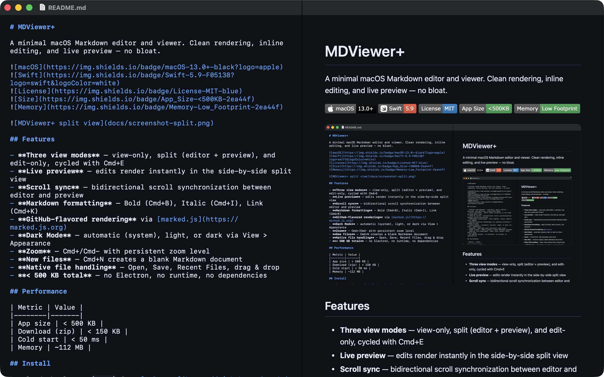

# MDViewer+

A minimal macOS Markdown editor and viewer. Clean rendering, inline editing, and live preview — no bloat.




## Features

- **Three view modes** — view-only, split (editor + preview), and edit-only, cycled with Cmd+E
- **Live preview** — edits render responsively in the side-by-side split view
- **Syntax highlighting** — incremental highlighting for headings, bold, italic, links, code blocks, blockquotes, and lists
- **Scroll sync** — bidirectional scroll synchronization between editor and preview
- **Markdown formatting** — Bold (Cmd+B), Italic (Cmd+I), Link (Cmd+K)
- **Secure GitHub-flavored rendering** via [marked.js](https://marked.js.org) and [DOMPurify](https://github.com/cure53/DOMPurify)
- **Sandboxed local resources** — relative images and links work after one persisted folder authorization
- **Coordinated themes** — eight trusted palettes across editor, syntax, preview, selection, and native surfaces
- **Print** — Cmd+P prints the current document from any view mode with paginated A4 output
- **Context-aware zoom** — Cmd+/Cmd- targets the active pane: preview in view mode, editor font in edit mode, focused pane in split mode
- **New files** — Cmd+N creates a blank Markdown document
- **Sibling navigation** — Cmd+Option+Left/Right opens the previous or next Markdown file by filename without wrapping
- **Native file handling** — Open, Save, Recent Files, drag & drop
- **About 1.5 MB total** — no Electron or external runtime

## Performance

| Metric | Value |
|--------|-------|
| App size | ~1.5 MB |
| Download (zip) | ~431 KB |
| Cold start | < 50 ms |
| Memory | ~112 MB |

## Install

Download the latest signed DMG from [Releases](https://github.com/trsdn/mdviewerplus/releases) or build from source:

```bash
brew install xcodegen
xcodegen generate
xcodebuild -scheme MDViewerPlus -configuration Release build
```

## Signed DMG Release

Create a local release config from `.release.env.example`, then run:

```bash
scripts/release_macos.sh
```

The GitHub release workflow builds a signed, notarized DMG on `v*` tags. Configure these repository secrets first:
`MACOS_CERTIFICATE`, `MACOS_CERTIFICATE_PWD`, `APPLE_ID`, `APPLE_TEAM_ID`, and `APPLE_APP_PASSWORD`.

## Keyboard Shortcuts

| Action | Shortcut |
|--------|----------|
| Print | `Cmd P` |
| Toggle View Mode | `Cmd E` |
| Bold | `Cmd B` |
| Italic | `Cmd I` |
| Link | `Cmd K` |
| Save | `Cmd S` |
| New File | `Cmd N` |
| Previous Markdown File | `Cmd Option Left` |
| Next Markdown File | `Cmd Option Right` |
| Reload | `Cmd R` |
| Zoom In | `Cmd +` |
| Zoom Out | `Cmd -` |
| Actual Size | `Cmd 0` |
| System Appearance | `Cmd Shift 0` |
| Light Mode | `Cmd Shift 1` |
| Dark Mode | `Cmd Shift 2` |

## Appearance and themes

Choose **MDViewer+ > Settings** to select an appearance mode plus one preferred
light and dark palette. System mode reacts to the current macOS appearance.
The View > Appearance commands and `Cmd Shift 0/1/2` shortcuts remain unchanged.

- **Light:** GitHub Light, Solarized Light, Sepia
- **Dark:** GitHub Dark, Solarized Dark, Dracula, Monokai, Nord

Theme changes update the editor and preview together without re-rendering the
document. Text-bearing palette colors meet WCAG AA contrast of at least 4.5:1.
Printing always uses its dedicated white, high-contrast palette.

## Dependencies

| Library | Version | License | Purpose |
|---------|---------|---------|---------|
| [marked](https://github.com/markedjs/marked) | 15.0.7 | MIT | Markdown → HTML parsing |
| [DOMPurify](https://github.com/cure53/DOMPurify) | 3.4.12 | Apache-2.0 OR MPL-2.0 | HTML sanitization |

No Swift package dependencies or third-party native frameworks. JavaScript dependencies and their license notices are bundled with the app.

## Security and local resources

Release builds use the macOS App Sandbox and Hardened Runtime. Rendered HTML is sanitized, remote embedded resources are blocked, and external links open in their default app.

Relative images and local links require access to the Markdown document’s folder. MDViewer+ asks once, stores an app-scoped security bookmark, and limits WebKit reads to raster images inside that authorized folder.

Sibling navigation uses the same persisted folder authorization. Choose **File >
Enable Sibling Navigation…** once for a folder; normal document opening never
prompts for navigation access. After authorization, the command becomes
**Refresh Sibling Navigation**. It and **Reload** rescan the folder so newly
added or removed Markdown files are reflected at the navigation boundaries.
Reload stays silent when folder access is unavailable; only the explicit
Enable/Refresh command requests access or reports folder-access errors.

## License

[MIT](LICENSE)
