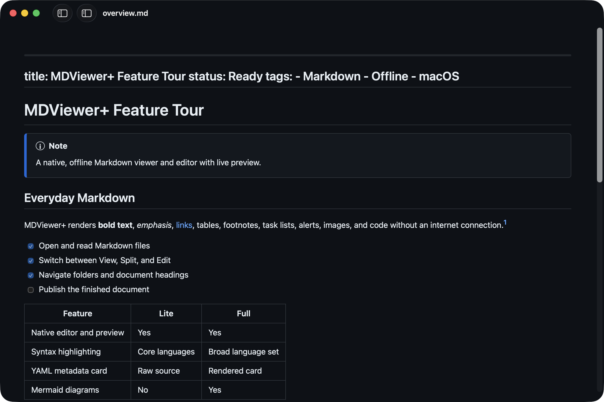
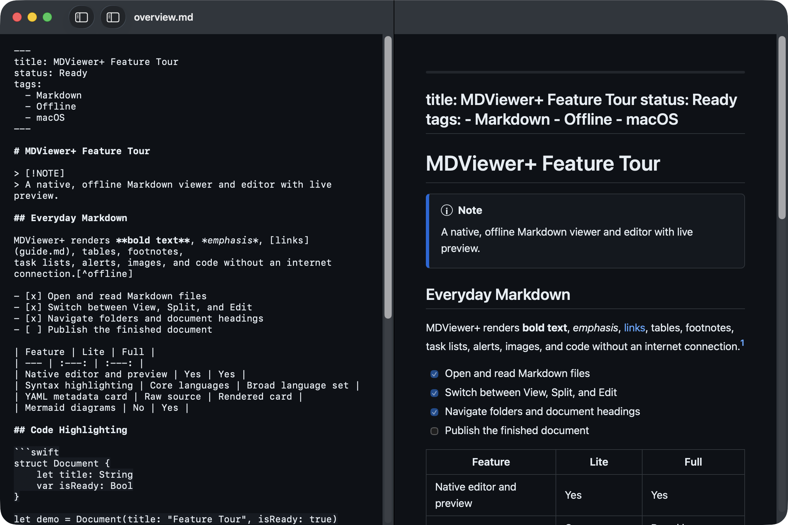
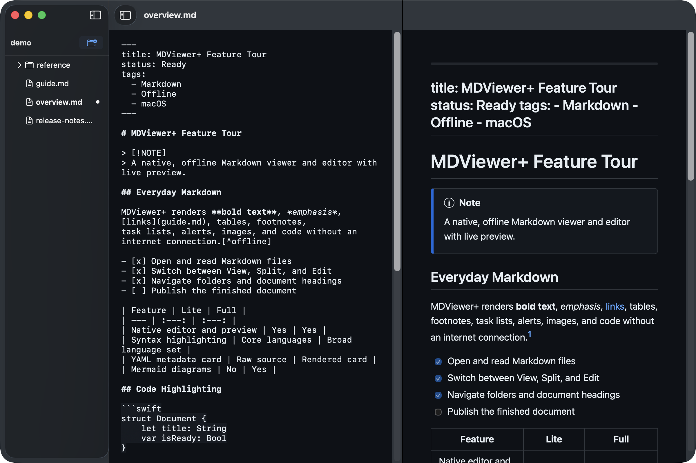
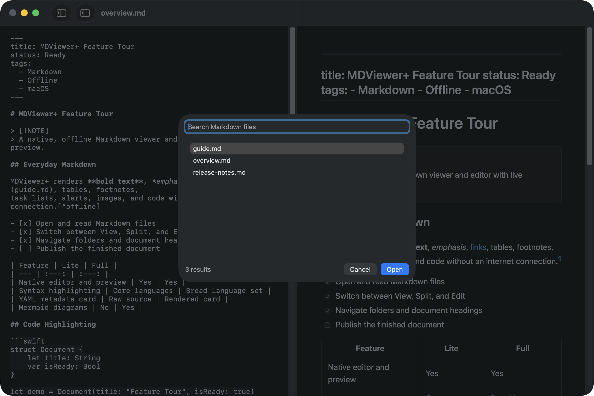
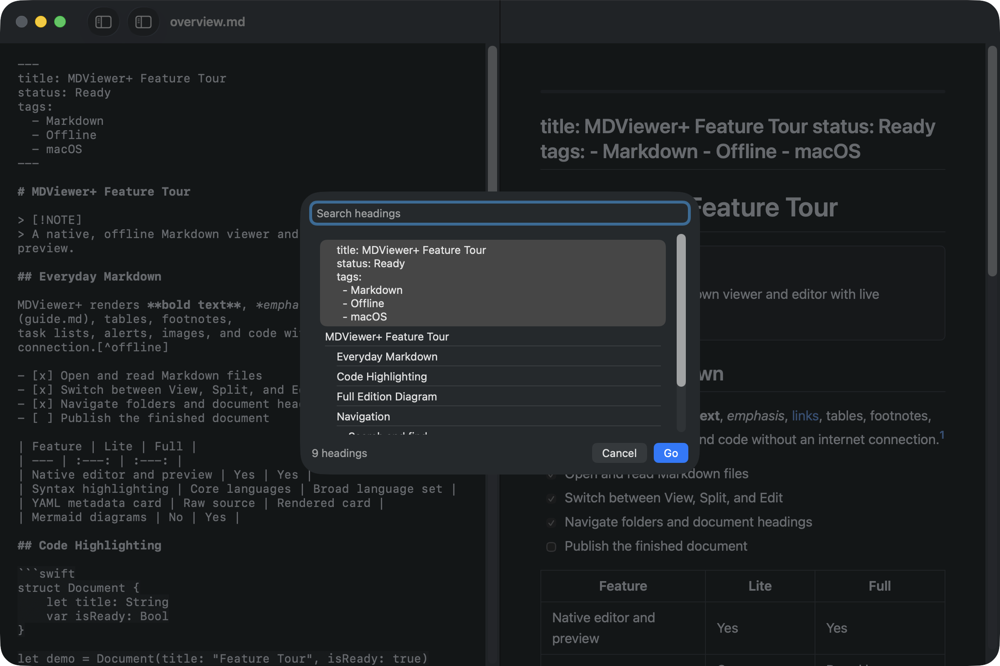
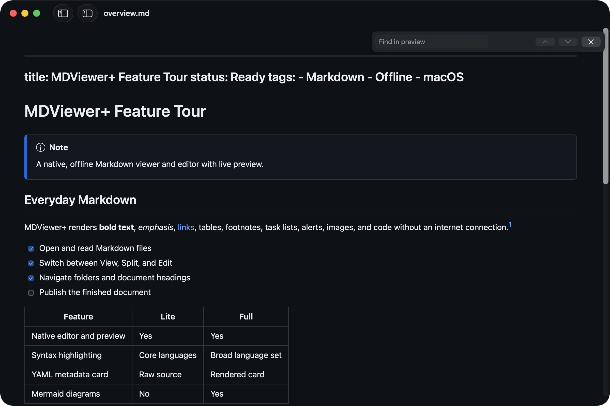
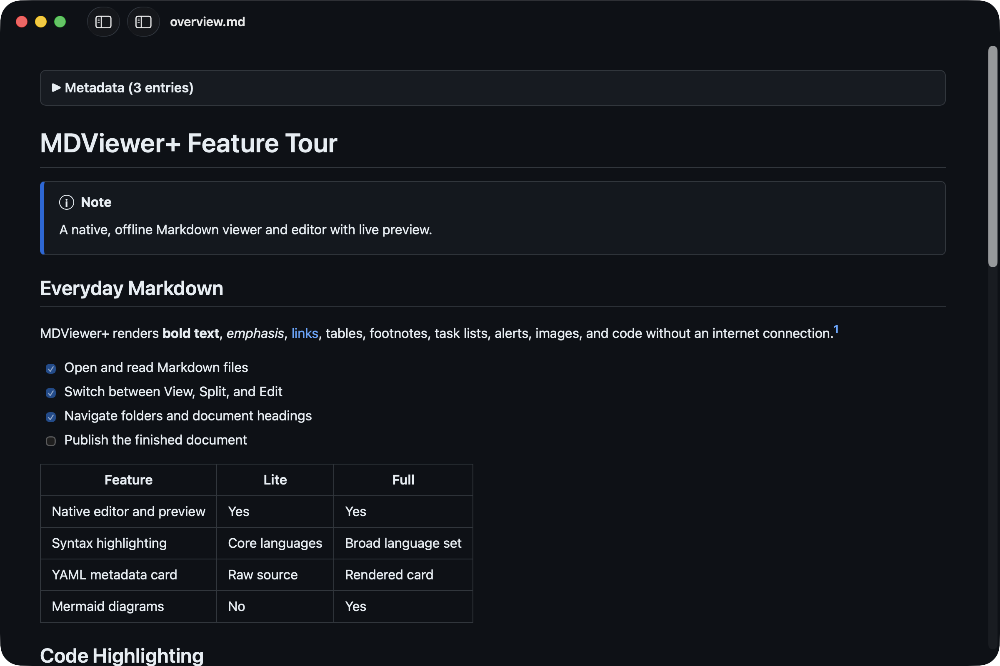
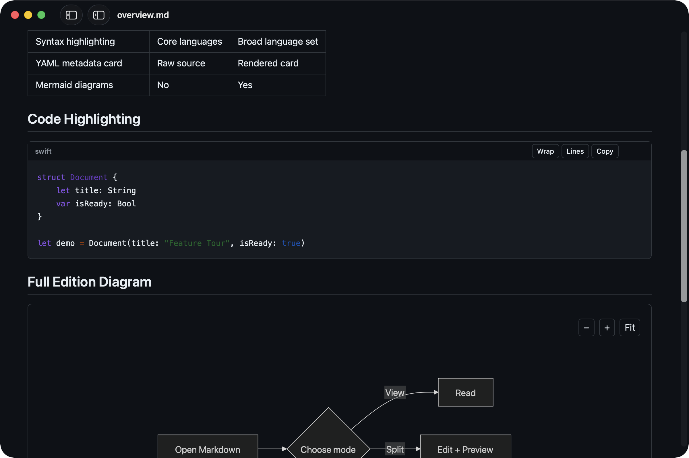
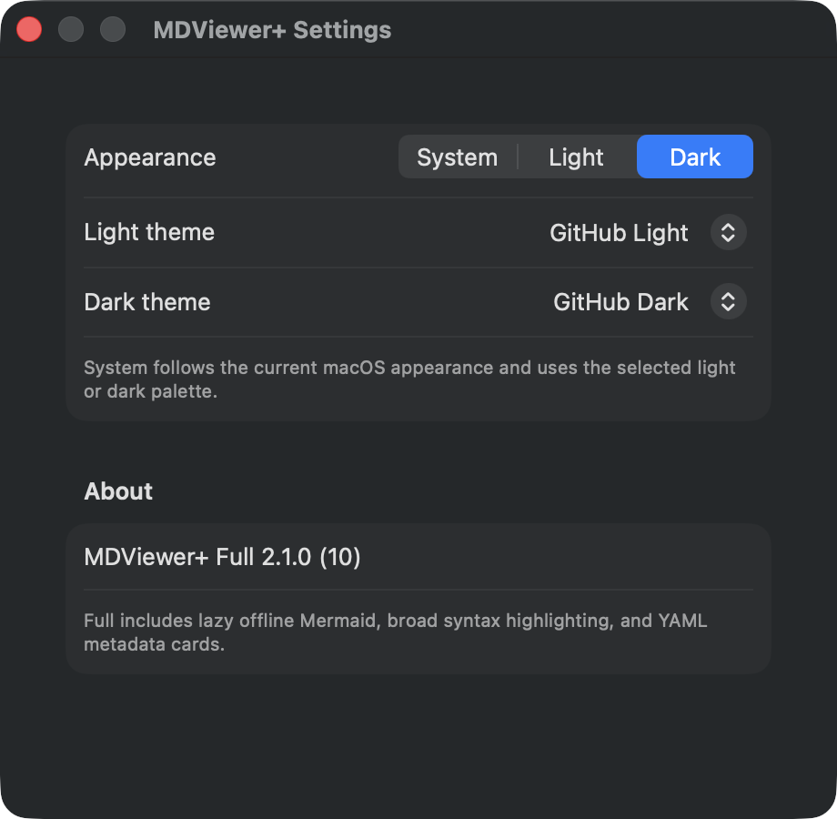
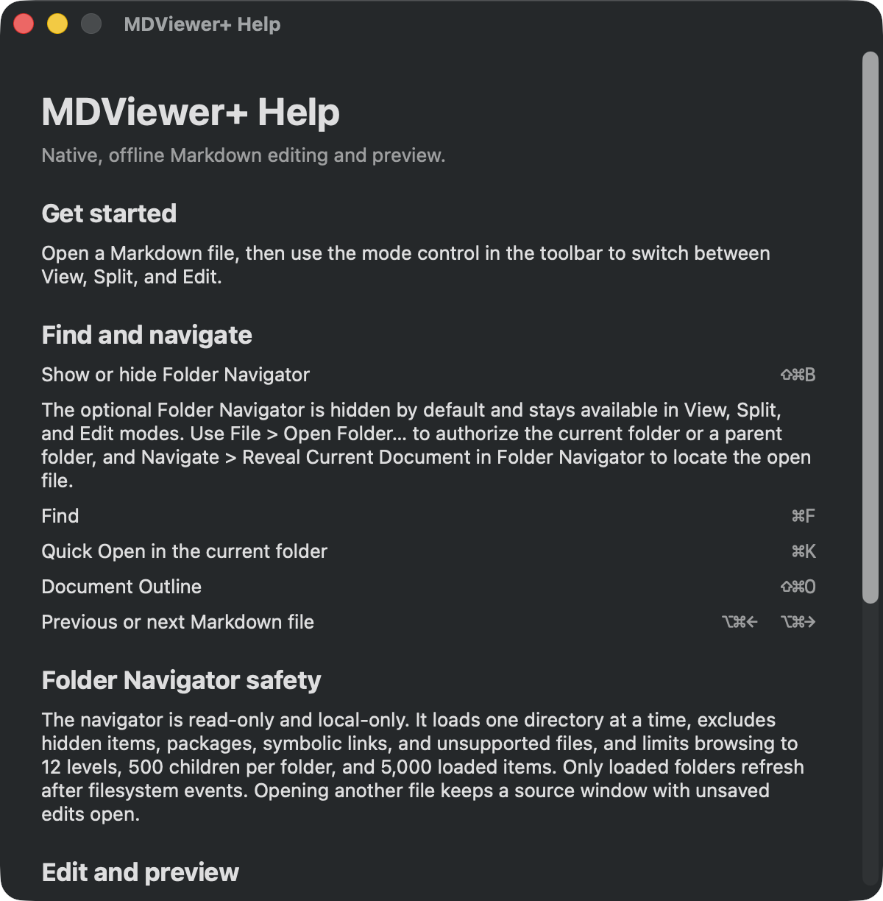

# MDViewer+ – Oberflächen und Grundfunktionen

> **Kurzbeschreibung:** MDViewer+ ist ein nativer, vollständig offline arbeitender
> Markdown-Viewer und -Editor für macOS. Die Software bietet eine formatierte
> Vorschau, Live-Bearbeitung, Datei- und Überschriftennavigation, Suche,
> verschiedene Farbschemata und Druckunterstützung. Die **Lite-Edition**
> konzentriert sich auf einen kleinen Funktionsumfang und eine geringe
> Dateigröße. Die **Full-Edition** ergänzt breite Syntaxhervorhebung, aufbereitete
> YAML-Metadaten und Mermaid-Diagramme.

Die folgenden zehn Screenshots bilden die wichtigsten Oberflächen und
repräsentativen Testfälle beider Editionen ab. Gemeinsame Funktionen werden an
der Lite-Edition gezeigt; Full-spezifische Renderer und Einstellungen an der
Full-Edition.

## 1. Lite – Leseansicht

Die reine Vorschau rendert Überschriften, Hinweise, Textformatierung, Links,
Aufgabenlisten, Tabellen und Fußnoten. YAML-Frontmatter bleibt in Lite als
normaler Inhalt sichtbar.

## 2. Lite – Geteilte Editor- und Vorschauansicht

Im Split-Modus steht links der Markdown-Quelltext und rechts die unmittelbar
aktualisierte Vorschau. Die beiden Bereiche unterstützen synchronisiertes
Scrollen.

## 3. Lite – Ordnernavigation

Die optionale Seitenleiste zeigt unterstützte Markdown-Dateien und Unterordner.
Das aktuelle Dokument ist markiert; Dateien können aus der Navigation geöffnet
werden.

## 4. Lite – Quick Open

Quick Open (`⌘K`) durchsucht die Markdown-Dateien im freigegebenen Ordner und
ermöglicht einen schnellen Dokumentwechsel über Tastatur oder Maus.

## 5. Lite – Dokumentgliederung

Die Gliederung (`⇧⌘O`) listet alle Überschriften hierarchisch auf. Ein
Suchfeld filtert die Einträge; **Go** springt direkt zur gewählten Stelle.

## 6. Lite – Suche in der Vorschau

Die Vorschau-Suche (`⌘F`) erscheint als kompakte Leiste mit Eingabefeld,
Navigation zum vorherigen beziehungsweise nächsten Treffer und Schließen-
Schaltfläche.

## 7. Full – Gerenderte YAML-Metadaten

Die Full-Edition erkennt YAML-Frontmatter und zeigt es als einklappbare,
bereinigte Metadatenkarte. Der übrige Markdown-Inhalt wird wie in Lite
formatiert dargestellt.

## 8. Full – Syntaxhervorhebung und Mermaid

Codeblöcke erhalten eine erweiterte Syntaxhervorhebung sowie Steuerelemente für
Zeilenumbruch, Zeilennummern und Kopieren. Mermaid-Diagramme werden offline
gerendert und können gezoomt oder an die Ansicht angepasst werden.

## 9. Full – Einstellungen

Die Einstellungen bieten System-, Hell- und Dunkelmodus sowie getrennte
Farbpaletten für helle und dunkle Darstellung. Der Bereich **About** nennt
Edition, Version, Build und die edition-spezifischen Funktionen.

## 10. Full – Integrierte Hilfe

Die integrierte Hilfe beschreibt Einstieg, Ansichtsmodi, Ordnernavigation,
Suche, Quick Open, Dokumentgliederung, Tastenkürzel und Sicherheitsgrenzen der
lokalen Navigation.
